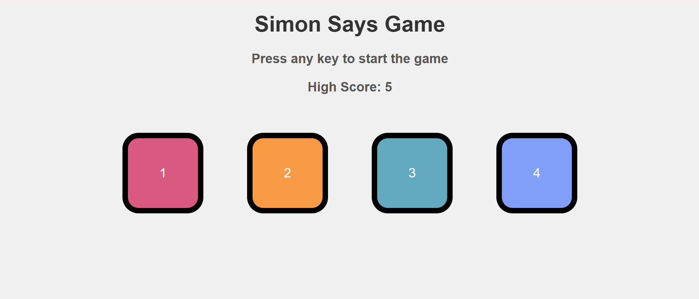

# Simon Says Memory Game

A modern, web-based adaptation of the classic Simon Says memory game. Test your memory and cognitive skills by repeating randomized sequences of lights and sounds. Built with HTML, CSS, and JavaScript, this game is designed to be simple, engaging, and responsive across all devices.

---

## Table of Contents
- [Features](#features)
- [Demo](#demo)
- [Installation](#installation)
- [Usage](#usage)
- [Customization](#customization)
- [Contributing](#contributing)
- [Acknowledgements](#acknowledgements)

---

## Features
- **Dynamic Sequence Generation**: Randomized patterns that increase in length as you progress.
- **Audio-Visual Feedback**: Each button press triggers a unique sound and visual flash.
- **Score Tracking**: Real-time score display with a high-score leaderboard.
- **Strict Mode**: Optional mode where a single mistake ends the game.
- **Responsive Design**: Fully compatible with desktop, tablet, and mobile devices.
- **Game State Management**: Save and resume progress using `localStorage`.
- **Minimalist UI**: Clean and intuitive user interface for seamless gameplay.

---

## Demo
Play the game live: [Simon Says Memory Game Demo](https://yourusername.github.io/simon-says-game)  

  
*Screenshot of the Simon Says Memory Game in action.*

---

## Installation
To run the game locally, follow these steps:

1. Clone the repository:
   ```bash
   git clone https://github.com/yourusername/simon-says-game.git

## Usage
1. Start the Game: Click the "Start" button to begin.
2. Observe the Sequence: Watch and listen carefully as the game displays a sequence of lights and sounds.
3. Repeat the Sequence: Click the colored buttons in the exact same order.
4.Progress: Each correct repetition increases the sequence length and your score.
5. Game Over: If you make a mistake, the game ends, and your final score is displayed. Click "Restart" to try again.

## Customization
You can easily customize the game to suit your preferences by editing the config.js file:

const config = {
  sequenceSpeed: 1000, // Time (in milliseconds) between sequence steps
  maxSequenceLength: 20, // Maximum length of the sequence
  strictMode: false, // Enable or disable strict mode (game ends on first mistake)
  colorPalette: ['#ff0000', '#00ff00', '#0000ff', '#ffff00'], // Button colors
  soundEffects: {
    red: 'sounds/red.mp3',
    green: 'sounds/green.mp3',
    blue: 'sounds/blue.mp3',
    yellow: 'sounds/yellow.mp3'
  }
};

## Contributing
1.We welcome contributions! If you'd like to contribute to this project, please follow these steps:
2. Fork the repository and create a new branch for your feature or bugfix.
3. Make your changes and test them thoroughly.
4. Submit a pull request with a detailed description of your changes.
5.Ensure your code follows the existing style and conventions.

## Acknowledgements
Inspired by the classic Simon® electronic game by Milton Bradley.
Sound effects sourced from freesound.org.
Built with vanilla JavaScript, HTML, and CSS for zero-dependency performance.
